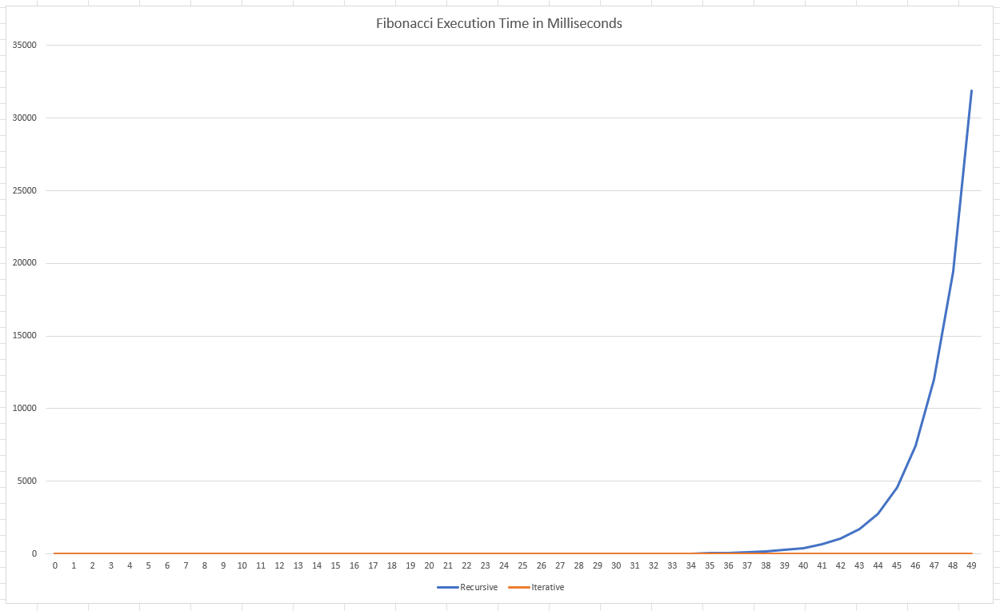
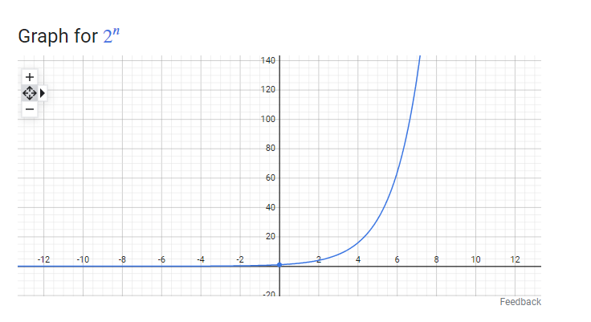

# Fibonacci Comparison

Compares the performance of the iterative and recursive implementations of the Fibonacci sequence.

The similarity between the graph of the recursive execution time and the graph of y = 2^x is remarkable:

